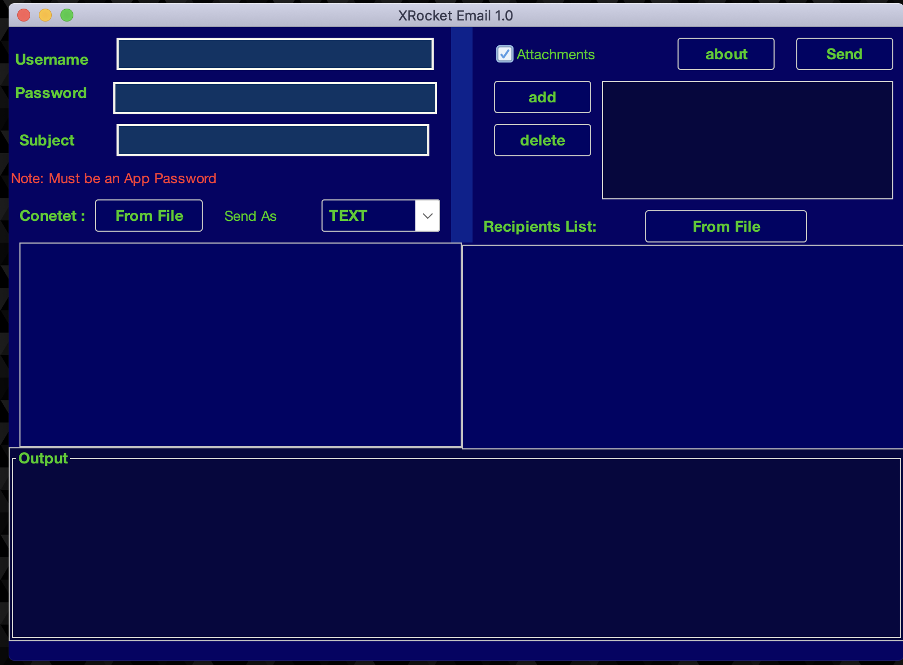

# XRocket Email Tool for Sending Emails to Multiple Users

Overview

This Java application allows users to send emails to multiple recipients simultaneously

Requirements
  # Devloper 
    Java Development Kit (JDK) 17 or higher
    NetBeans IDE (or any Java IDE of your choice)
    Internet connection for sending emails
  # user  
    Java JRE  17 or higher

Installation
  # Devloper 
    Clone the repository from [GitHub URL] or download the ZIP file.
    Open the project in NetBeans IDE.
    Build the project to resolve dependencies.
  # user 
     Clone the repository from [GitHub URL] or download the ZIP file.
     uzip bin/XRoecketEmail.zip
      java -jar  XRoecketEmail.zip
# Screenshots

# Feedback
  For questions, issues, or feedback, please contact [alphaben] at [bennamrouchex@gamil.com]
